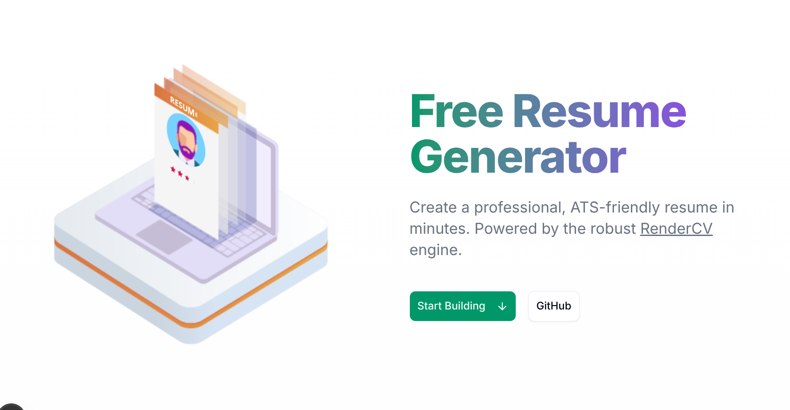

# Free Resume Generator (AI-Powered & ATS-Friendly)

[](https://opensource.org/licenses/MIT)
[](https://github.com/sinaatalay/rendercv)

A free, open-source resume generator that transforms your profile into ATS-friendly PDF resumes using LaTeX. Features AI assistance, real-time preview, and privacy-focused local processing.

**Live Demo:** [https://web-nfic64zsa-abdssamies-projects.vercel.app](https://web-nfic64zsa-abdssamies-projects.vercel.app) 



## 🌟 Key Features

- **ATS-Friendly PDF Output:** Powered by [RenderCV](https://github.com/sinaatalay/rendercv) (LaTeX-based).
- **AI Agent Integration:** Built-in conversational AI prompt to help you draft content effortlessly.
- **Privacy First:** All processing happens locally or on your own server. No data mining.
- **Real-Time Preview:** Split-screen editor with instant visual feedback.
- **Comprehensive Sections:**
    - Professional Summary
    - Work Experience (with "Present" date support)
    - Education
    - Projects & Portfolio
    - Skills (Grouped categories)
    - Custom Sections (Certifications, Awards, etc.)
- **Theme Support:** Choose from classic, modern, and engineering templates.
- **Import/Export:** Support for YAML import and export.

## 🚀 Quick Start

### Prerequisites
- Python 3.13+ (Backend)
- Node.js 18+ (Frontend)
- [uv](https://github.com/astral-sh/uv) (Python package manager)
- pnpm (Node package manager)

### Installation

1. **Clone the repository**
   ```bash
   git clone https://github.com/Abdssamie/resume-generator.git
   cd resume-generator
   ```

2. **Backend Setup** (FastAPI)
   ```bash
   # Install dependencies
   uv sync
   
   # Run the server
   uv run uvicorn api.main:app --reload --port 8000
   ```

3. **Frontend Setup** (Next.js)
   ```bash
   cd web
   
   # Install dependencies
   pnpm install
   
   # Run the dev server
   pnpm dev
   ```
   
4. Open [http://localhost:3000](http://localhost:3000)

## 🐳 Docker Support

Run the entire stack with a single command:

```bash
docker-compose up -d
```

## 🛠 Tech Stack

- **Frontend:** Next.js 15, React 19, TailwindCSS, shadcn/ui, Lucide Icons, Framer Motion (Lottie).
- **Backend:** FastAPI, Python 3.13, RenderCV, PyYAML, SlowAPI (Rate Limiting).
- **Tools:** uv, pnpm, Docker.

## 🤝 Contributing

Contributions are welcome! Please feel free to submit a Pull Request.

1. Fork the project
2. Create your feature branch (`git checkout -b feature/AmazingFeature`)
3. Commit your changes (`git commit -m 'Add some AmazingFeature'`)
4. Push to the branch (`git push origin feature/AmazingFeature`)
5. Open a Pull Request

## 📄 License

Distributed under the MIT License. See `LICENSE` for more information.

## 🙏 Acknowledgments

- [RenderCV](https://github.com/sinaatalay/rendercv) for the underlying LaTeX rendering engine.
- [shadcn/ui](https://ui.shadcn.com/) for the beautiful component library.
